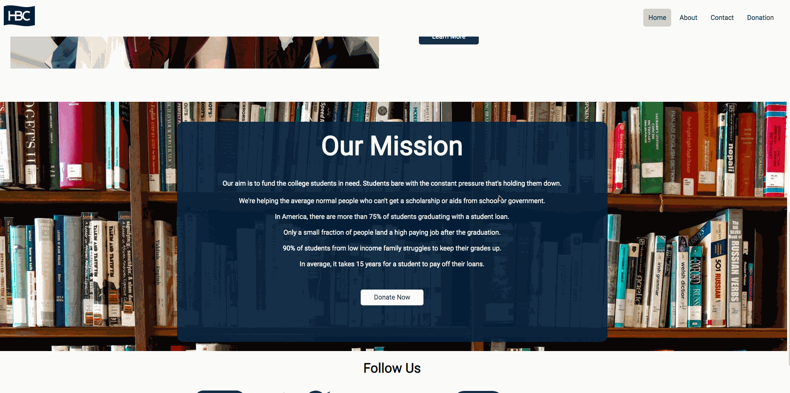

### *Name: Chanyu C., Christopher E., Cherena B., Elvis O.*

### Group Project: Tech Talent Pipeline: Cohort 5 - Bootcamp
### Program Name: HBC Funds College Students

### Description: 
``` 
This is a HBC Donation website. HBC Donates to selective group of people with a lot of loans on
their hands. Currently, they're serving for a public school called Lehman College. There are some
gray areas that both aids and scholarship does not cover and HBC Donation group is to fill up that
hole to hopefully pressure off college students from being in too much debt. 
It has no GPA standards or rules. You just need to be enrolled in full time as a current student with
proof that you're in a deep debt. 

HBC Donation site currently features a main page, about page, donation page and contact form page.
The code consists of HTML and CSS only. It has a nice modern look. 
```

### Pictures:


### Assignment:

```
Choose a cause that your group really cares about and put together a small informational website
using HTML/CSS trying to convince people to donate to or help this cause. This site should be
2-3 pages and look as professional as possible using modern design trends. Research similar
websites to get inspiration.

Once you have decided on a cause, begin by selecting one member to create a Git repo with an
index.html file, push it to GitHub, and then add the other teammates as collaborators on the repo.
Throughout this workshop, each teammate should be communicating often and using GitHub
effectively. Remember no one should be working off Master so create branches, resolve merge
conflicts, and create and close issues.
```

* HTML is formatted properly
* CSS is formatted properly
* At least 2-3 pages
* User can clearly navigate throughout website.
* Thoughtful styling has been applied.
* Create issues for each of the different pages and aspects of the site and assign each to
a teammate. You'll be expected to create at least 3 issues
* Make sure that the commit messages for commits involving each issue reference the
issue. For instance, git commit -m "Menu completed, closes #14'

### Disclaimer:
```
This website contains copyrighted materials and images from Hudson's Bay Company. 
HBC is owned and operated by NRDC Equity Partners. I do not own HBC, this website 
is made solely for education purposes. HBC has every rights on this. 
```